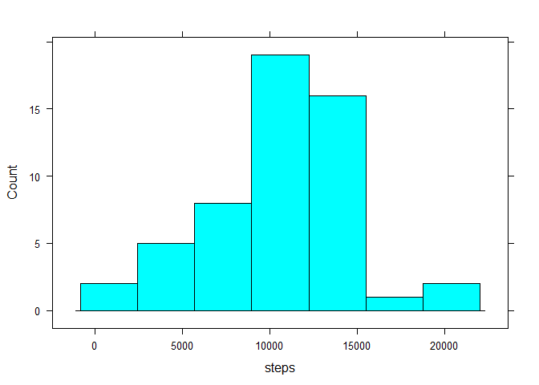
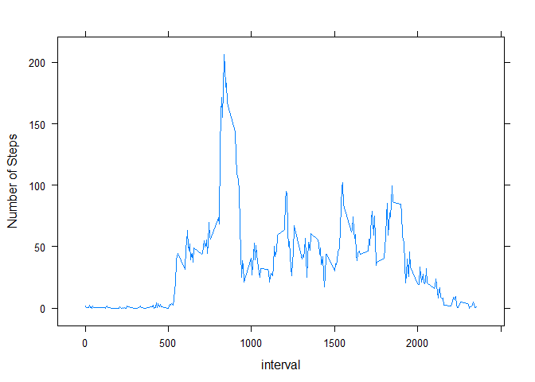
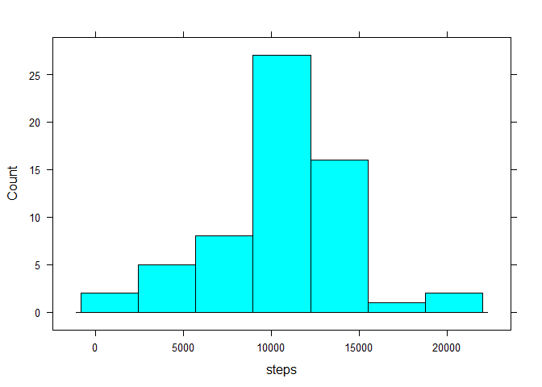
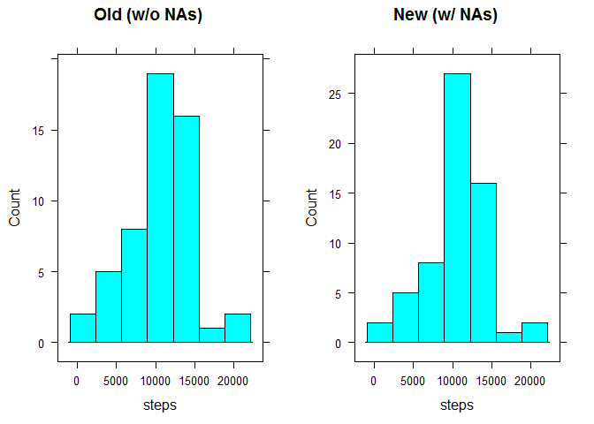

# Reproducible Research: Peer Assessment 1
___

## Loading and preprocessing the data

Before running analysis, ensure that your working directory is set to /RepData_PeerAssessment1 

Read in zipped csv file *activity.csv* into R 


```r
activity <- read.csv(unz("activity.zip","activity.csv"),
                       colClasses = c("numeric","character","numeric")) 
```

___

## What is mean total number of steps taken per day?

####Create a table that reports the total steps per day


```r
total <- aggregate(steps ~ date,activity,sum)
total
```

```
##          date steps
## 1  2012-10-02   126
## 2  2012-10-03 11352
## 3  2012-10-04 12116
## 4  2012-10-05 13294
## 5  2012-10-06 15420
## 6  2012-10-07 11015
## 7  2012-10-09 12811
## 8  2012-10-10  9900
## 9  2012-10-11 10304
## 10 2012-10-12 17382
## 11 2012-10-13 12426
## 12 2012-10-14 15098
## 13 2012-10-15 10139
## 14 2012-10-16 15084
## 15 2012-10-17 13452
## 16 2012-10-18 10056
## 17 2012-10-19 11829
## 18 2012-10-20 10395
## 19 2012-10-21  8821
## 20 2012-10-22 13460
## 21 2012-10-23  8918
## 22 2012-10-24  8355
## 23 2012-10-25  2492
## 24 2012-10-26  6778
## 25 2012-10-27 10119
## 26 2012-10-28 11458
## 27 2012-10-29  5018
## 28 2012-10-30  9819
## 29 2012-10-31 15414
## 30 2012-11-02 10600
## 31 2012-11-03 10571
## 32 2012-11-05 10439
## 33 2012-11-06  8334
## 34 2012-11-07 12883
## 35 2012-11-08  3219
## 36 2012-11-11 12608
## 37 2012-11-12 10765
## 38 2012-11-13  7336
## 39 2012-11-15    41
## 40 2012-11-16  5441
## 41 2012-11-17 14339
## 42 2012-11-18 15110
## 43 2012-11-19  8841
## 44 2012-11-20  4472
## 45 2012-11-21 12787
## 46 2012-11-22 20427
## 47 2012-11-23 21194
## 48 2012-11-24 14478
## 49 2012-11-25 11834
## 50 2012-11-26 11162
## 51 2012-11-27 13646
## 52 2012-11-28 10183
## 53 2012-11-29  7047
```

####Create a histogram for total steps per day (total)

```r
library(lattice)
histogram(~ steps, total, type = "count") 
```

<!-- -->

####Calculate and report the mean/median of total steps per day (total)

```r
mean(total$steps, na.rm = TRUE)
```

```
## [1] 10766.19
```

```r
median(total$steps, na.rm = TRUE)
```

```
## [1] 10765
```

___

## What is the average daily activity pattern?

####Make a time series plot (i.e. type = "l") of the 5-minute interval (x-axis) and the average number of steps taken, averaged across all days (y-axis)


```r
totalinterval <- aggregate(steps ~ interval,activity,mean)
xyplot(steps ~ interval, totalinterval, type = "l")
```

<!-- -->

####Which 5-minute interval, on average across all the days in the dataset, contains the maximum number of steps?


```r
totalinterval[which.max(totalinterval$steps),1]
```

```
## [1] 835
```

___

## Imputing missing values

####Calculate and report the total number of missing values in the dataset (i.e. the total number of rows with NAs)


```r
colSums(is.na(activity))
```

```
##    steps     date interval 
##     2304        0        0
```

####Devise a strategy for filling in all of the missing values in the dataset. 

Strategy = use the mean for of each 5-minute interval; if NA, then populate with that mean (rounded to nearest whole number)

####Create a new dataset that is equal to the original dataset but with the missing data filled in.


```r
#Run loop to populate NA with global mean for 5-minute interval (round to nearest whole number)
intervals <- unique(activity$interval)

for(i in 1:288) {
activity[activity$interval == intervals[[i]] & is.na(activity$steps),1] <- 
   totalinterval[totalinterval$interval == round(intervals[[i]],0),2]
}

#Check whether any NAs left unpopulated
colSums(is.na(activity))
```

```
##    steps     date interval 
##        0        0        0
```

####Make a histogram of the total number of steps taken each day  


```r
totalnona <- aggregate(steps ~ date,activity,sum)

histogram(~ steps, totalnona, type = "count")
```

<!-- -->

####Calculate and report the mean and median total number of steps taken per day

```r
mean(totalnona$steps, na.rm = TRUE)
```

```
## [1] 10766.19
```

```r
median(totalnona$steps, na.rm = TRUE)
```

```
## [1] 10766.19
```

####Do these values differ from the estimates from the first part of the assignment?


```r
summary(total)
```

```
##      date               steps      
##  Length:53          Min.   :   41  
##  Class :character   1st Qu.: 8841  
##  Mode  :character   Median :10765  
##                     Mean   :10766  
##                     3rd Qu.:13294  
##                     Max.   :21194
```

```r
summary(totalnona)
```

```
##      date               steps      
##  Length:61          Min.   :   41  
##  Class :character   1st Qu.: 9819  
##  Mode  :character   Median :10766  
##                     Mean   :10766  
##                     3rd Qu.:12811  
##                     Max.   :21194
```

Yes - compare the summary statistics; the number of dates included in the analysis increases when populating the NAs and the overall distribution appears different when looking at summary quartile data.

####What is the impact of imputing missing data on the estimates of the total daily number of steps?


```r
plotold <- histogram(~ steps, total, type = "count",main = "Old (w/o NAs)")
plotnew <- histogram(~ steps, totalnona, type = "count", main = "New (w/ NAs)")

print(plotold, split = c(1,1,2,1), more = TRUE)
print(plotnew, split = c(2,1,2,1))
```

<!-- -->

Compare the histograms for both distributions. The new data set with NAs populated is more concentrated at the mean than the data set where NAs where excluded.

___

## Are there differences in activity patterns between weekdays and weekends?

####Create a new factor variable in the dataset with two levels - "weekday" and "weekend" 


```r
activity$date <- strptime(activity$date, format = "%Y-%m-%d")

activity$day <- weekdays(activity$date, abbreviate = TRUE)
activity$day <- factor(ifelse(activity$day == "Sat"|activity$day == "Sun","weekend","weekday"))
```

####Make a panel plot containing a time series plot (i.e. type = "l") of the 5-minute interval
(x-axis) and the average number of steps taken, averaged across all weekday days or weekend days
(y-axis).


```r
totalday <- aggregate(steps ~ as.character(date) + interval + day,activity,mean)
totaldayavg <- aggregate(steps ~ interval + day,totalday,mean)

xyplot(steps ~ interval | day, totaldayavg, type = "l", layout = c(1,2))
```

<!-- -->
